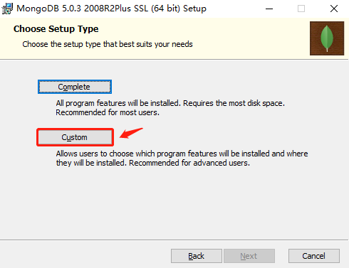
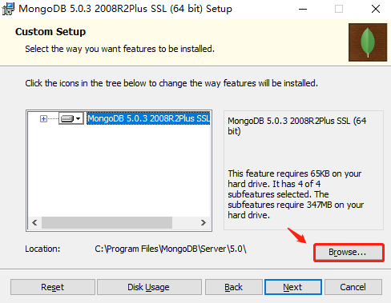
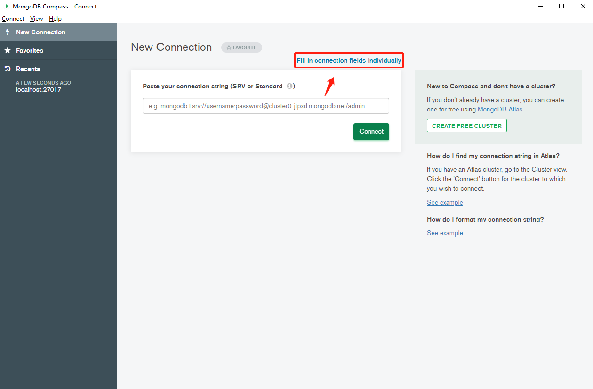
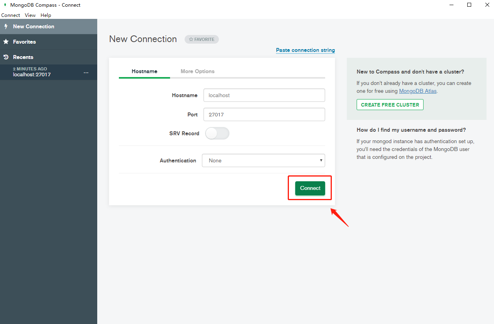
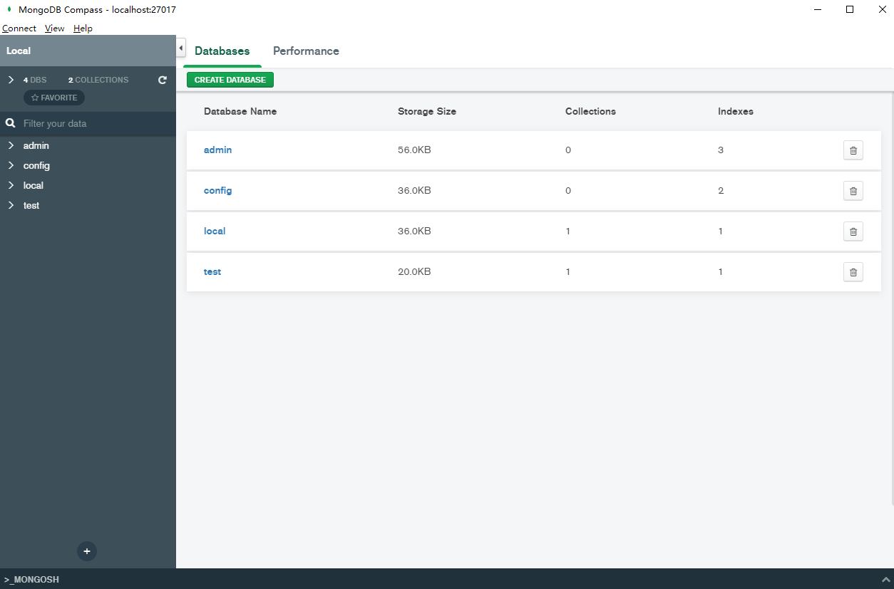

# 一、概述

[mongoosejs-docs >>](https://mongoosejs.com/docs/guide.html)

[mongoDB 官方文档中文版 >>](https://docs.mongoing.com/)

MongoDB是一个由C++ 语言编写的 **基于分布式文件存储的数据库**

MongoDB 将数据存储为一个文档，数据结构由键值（`key:value`）对组成。MongoDB 文档类似于 JSON 对象。字段值可以包含其他文档，数组及文档数组。


## 1. vs mySql

- Mysql 数据库是类似于Excel **表格式** 的数据，这种表格式的数据库也称之为 **关系型数据库**，表叫做**关系表**。

- MongoDB 数据库存储的是类似 **JSON** 格式的数据，称之为 **bson**，这种数据库由于比较自由，数据间并不一定有关系，我们称之为**非关系型数据库**。然后又由于不是表结构，我们不再使用sql语句去操作他，所以我们也称MongoDB为 **nosql** 数据库的一种。

## 2. 特点

高性能、易部署、易使用，存储数据非常方便。

## 3. 诞生目的

**MongoDB** 是 **mysql** 等关系型数据库的一种补充。无可否认的，mysql等关系型数据库非常有用，并且在很多业务场景中都发挥了极大的作用。但是，它并不是万能的。在进入到web2.0时代（由用户主导而生成的内容互联网产品模式）后，mysql遇到了很多他没法实现或很难实现的问题，但是这个问题却又必须要解决，于是就诞生了nosql系列的非关系型数据，其中MongoDB就是一个代表。

所以MongoDB的诞生目的就是为了补充mysql等关系数据库不足的，即用来完成mysql等数据库无法完成或很难完成的任务。例如：

- 数据的高并发读写
- 数据的海量数据存储
- 数据的高可扩展性
- 数据的高可用性

# 二、下载安装

[点击前往官网下载中心 >>](https://www.mongodb.com/try/download/community)


根据系统，选择相应的安装包。

## 1. macOS

**① 将压缩包解压至任意位置，我放在 *`/usr/local/`* 目录下，并重新命名为 *`mongodb`***

**② 添加环境变量**

```shell
$ open ~/.bash_profile
```

```shell
export PATH=$PATH:/usr/local/mongodb/bin 
```

**③ 查看版本，如果正常显示版本号则安装成功**

```shell
$ mongo --version
MongoDB shell version v5.0.3
Build Info: {
    "version": "5.0.3",
    "gitVersion": "657fea5a61a74d7a79df7aff8e4bcf0bc742b748",
    "modules": [],
    "allocator": "system",
    "environment": {
        "distarch": "x86_64",
        "target_arch": "x86_64"
    }
}
```

**# Brew 下载**

[参考地址 >>](https://docs.mongodb.com/manual/tutorial/install-mongodb-on-os-x/)

```shell
$ brew tap mongodb/brew
$ brew install mongodb-community@4.2
$ mongo --version
MongoDB shell version v4.2.2
git version: a0bbbff6ada159e19298d37946ac8dc4b497eadf
allocator: system
modules: none
build environment:
    distarch: x86_64
    target_arch: x86_64
```

### 1.2. 创建目录

```shell
# 进入安装目录
$ cd /usr/local/mongodb/
# 创建日志输出、数据库目录
$ mkdir -p data/logs data/db
# 进入日志输出目录并创建日志文件
$ cd /data/logs && touch mongodb.log
```

### 1.3. 配置文件

```shell
$ vim /etc/mongodb.conf
```

按 `i` 输入如下内容：

```ini
# 数据库存放地址
dbpath=/usr/local/mongodb/data/db
# 日志输出文件路径
logpath=/usr/local/mongodb/data/logs/mongodb.log
# 错误日志采用追加模式，配置这个选项后mongodb的日志会追加到现有的日志文件，而不是从新创建一个新文件
logappend=true
# 启用日志文件，默认启用
journal=true
# 这个选项可以过滤掉一些无用的日志信息，若需要调试使用请设置为false
quiet=true
# 端口号
port=27017
# 守护进程
fork=true
# 绑定ip
bind_ip=127.0.0.1
# 开启认证
auth=true
```

按 `ESC` 输入 `:wq!` 保存退出！

### 1.4. 运行

```shell
# 通过配置文件启动mongodb
$ mongod -f /etc/mongodb.conf
```

如果出现successful就表示服务已经启动成功

浏览器输入：

```
http://localhost:27017/
```

网页呈现如下信息即表示成功：

```markdown
It looks like you are trying to access MongoDB over HTTP on the native driver port.
```

> 提示：后续使用mongodb只需要打开终端输入mongo指令即可。

### 1.5. 重启服务

1）打开mac 启动台 → 其他 → 活动监视器 → 删除 mongodb 服务

2）在 *`data/db/`* 目录下删除 mongod.lock 文件

3）终端执行：`mongod --repair`

4）根据配置文件启动：`mongod -f /etc/mongodb.conf`

## 2. Windows

### 2.1. 安装

**① 下载 msi 文件之后，双击安装**

**② 修改安装目录**

默认会安装到C盘，你可以修改安装目录：





**③. 取消勾选 Install MongoDB Compass**

在安装过程中会出现如下界面，其中**install mongoDB compass**"不要勾选需要去掉，否则可能要很长时间都一直在执行安装。

MongoDB Compass 是一个图形界面管理工具，我们可以在后面自己到官网下载安装，[前往下载 >>](https://www.mongodb.com/download-center/compass)。


**④ 安装完成**

- 安装目录下创建db目录：*`E:\MongoDB\data\db`*
- 然后将bin目录配置进入**环境变量**，配置步骤：右建此电脑 → 属性 → 高级系统设置 → 环境变量

### 2.2. 配置文件

创建配置文件：*`E:\MongoDB\conf\mongod.conf`*

文件内容同 macOS 环境，注意 db 和 logs 文件目录，如下所示：

```ini
# 数据库存放地址
dbpath=E:\MongoDB\data\db
# 日志输出文件路径
logpath=E:\MongoDB\log\mongod.log
# 错误日志采用追加模式，配置这个选项后mongodb的日志会追加到现有的日志文件，而不是从新创建一个新文件
logappend=true
# 启用日志文件，默认启用
journal=true
# 这个选项可以过滤掉一些无用的日志信息，若需要调试使用请设置为false
quiet=true
# 端口号
port=27017
# 绑定ip
bind_ip=0.0.0.0
# 开启认证
auth=false
```

### 2.3. 启动服务

```shell
# 命令行参数启动
$ mongod.exe --dbpath E:\MongoDB\data\db --serviceName "MongoDB"
# 配置文件方式启动
$ mongod.exe --config "E:\MongoDB\conf\mongod.cfg" --install --serviceName "MongoDB"
```

```shell
# 查看服务
services.msc
# 启用服务
net start mongodb
# 停止服务
net stop mongodb
```

> **Tips：** 使用管理员模式运行终端，切记切记！

# 三、概念

| SQL术语/概念  | MongoDB术语/概念 | 解释/说明                              |
| :------------ | :--------------- | :------------------------------------- |
| `database`    | `database`       | 数据库                                 |
| `table`       | `collection`     | 数据库表/集合                          |
| `row`         | `document`       | 数据记录行/文档                        |
| `column`      | `field`          | 数据字段/域                            |
| `index`       | `index`          | 索引                                   |
| `table joins` |                  | 表连接，MongoDB不支持                  |
| `Primary key` | `Primary key`    | 主键，MongoDB自动将`_id`字段设置为主键 |

> [参照 SQL 到 MongoDB 的映射图标 >>](https://docs.mongoing.com/mongodb-crud-operations/sql-to-mongodb-mapping-chart)

# 四、APIs

## 1. 用户管理

1）基础命令

```markdown
# 1. 创建用户
db.createUser({user:'账号', pwd:'密码', roles:[{role:'角色名', db: '数据库名'}]})
# 2. 查看用户
db.getUsers()
# 3. 移除用户
db.dropUser("用户名")
# 4. 用户登陆：success: 1, fail: 0
db.auth(user, pwd) 
```

代码示例：

```mysql
# 创建超级用户
> use admin
> db.createUser({user:'root', pwd:'123', roles:[{role:'root', db: 'admin'}]})
# 创建普通用户
> db.createUser({user:'lee', pwd:'123', roles:[{role:'readWrite', db: 'DB-TEST'}]})
```

> 提示：创建普通用户时需先登陆超级用户再创建。

2）角色分类

- 数据库用户角色：`read`、`readWrite`
- 数据库管理员角色：`dbAdmin`、`dbOwner`、`userAdmin`
- 集群管理员角色：`clusterAdmin`、`clusterManager`、`clusterMonitor`、`hostManager`
- 备份和恢复角色：`backup`、`restore`
- 所有数据库角色：`readAnyDatabase`、`readWriteAnyDatabase`、`userAdminAnyDatabase`、`dbAdminAnyDatabase`
- 超级用户角色：`root`

3）角色功能

- `read`：允许用户读取指定数据库
- `readWrite`：允许用户读写指定数据库
- `readAnyDatabase`：只在`admin`数据库中可用，赋予用户所有数据库的读权限
- `readWriteAnyDatabase`：只在`admin`数据库中可用，赋予用户所有数据库的读写权限
- `dbAdmin`：允许用户在指定数据库中执行管理函数，如索引创建、删除，查看统计或访问`system.profile`
- `dbAdminAnyDatabase`：只在`admin`数据库中可用，赋予用户所有数据库的`dbAdmin`权限。
- `userAdmin`：允许用户向`system.users`集合写入，可以找指定数据库里创建、删除和管理用户
- `userAdminAnyDatabase`：只在`admin`数据库中可用，赋予用户所有数据库的`userAdmin`权限
- `clusterAdmin`：只在`admin`数据库中可用，赋予用户所有分片和复制集相关函数的管理权限。
- `root`：只在`admin`数据库中可用。超级账号，超级权限

## 2. 数据库操作

```markdown
# 1. 查看数据库
show dbs
# 2. 创建/切换数据库
use <数据库名>
# 3. 查看当前数据库
db
# 4. 删除数据库
db.dropDatabase()
# 5. 查看MongoDB服务器地址
db.getMongo()
```

> 提示：刚创建的数据库需要插入数据才能够显示。

```mysql
> db.stus.insert({name:'Muzili', birth: '1993/07/16', origin: '成都市高新区'})
> show dbs
admin    0.000GB
config   0.000GB
db_test  0.000GB
local    0.000GB
```

## 3. 集合操作（表）

1）常用指令：

```markdown
# 1. 查看集合帮助
db.<数据库名>.help()
# 2. 创建集合
db.createCollection(name, options)
# 3. 创建集合并插入一个文档
db.COLLECTION_NAME.insert(文档对象)
# 4. 查看集合
show collections / show tables
# 5. 删除集合
db.COLLECTION_NAME.drop()
# 6. 修改表名
db.COLLECTION_NAME.renameCollection("NEW_NAME");
```

2）示例：

```shell
# 创建表
db.createCollection('usrs', {capped: true, size:6142800, max: 10000})
```

3）附录说明：

创建集合options说明：

| 字段          | 类型      | 描述                                                         |
| ------------- | --------- | ------------------------------------------------------------ |
| `capped`      | `Boolean` | （可选）如果为true，则创建固定集合。固定集合是指有着固定大小的集合，当达到最大值时，它会自动覆盖最早的文档。<br />**注意：当改值为  true 时，必须指定size 参数。** |
| `autoIndexId` | `Boolean` | （可选）如果为true，自动在 **_id** 字段创建索引，默认为 `false`。 |
| `size`        | `Number`  | （可选）为固定集合指定一个最大值，以千字节（KB）<br />**如果capped 为true，也需要指定该字段。** |
| `max`         | `Number`  | （可选）指定固定集合中包含文档的最大数量。                   |

> 提示：
>
> - 在插入文档时，MongoDB 首先检查固定集合的 size 字段，然后检查 max 字段，然后autoIndexId属性已经被遗弃了，未来将会被删除。
> - 在 MongoDB 中，其实当你插入一些文档时，MongoDB 也会自动创建集合。

## 4. 文档操作（行）

### 4.1. 插入文档

插入文档，类似于mysql 插入一行数据。

```markdown
# 1. 插入一个文档
db.COLLECTION_NAME.insertOne(document)
# 2. 插入多个数据
db.COLLECTION_NAME.insertMany(document[])
```

**① 复用性插入**

为了让数据可以更好的复用，我们可以先把要插入的数据，定义为一个变量，然后再进行插入。

```shell
document=({name:"赵六"})
db.COLLECTION_NAME.insertOne(document)
```

### 4.2. 查询文档

**1）查询文档**

语法形式：

```js
db.COLLECTION_NAME.find(query, projection)
```

参数解读：

- `query`：使用查询操作符指定选择过滤器 
- `projection`：指定返回字段，省略返回所有

示例：

```markdown
# 1. 查询所有
db.COLLECTION_NAME.find({})
# 2. 等值查询 - 查询 name = ‘tom’ 的数据
db.COLLECTION_NAME.find({name: 'Tom'})
# 2. 查询文档中的 name、age 字段，排除 _id 字段。
db.COLLECTION_NAME.find({}, {_id: false, name: true, age: true});
```

**2）查询操作符**

- `$in`：查询值 **为** 指定集合中某个元素时
- `$nin`：查询值 **不为** 指定集合中某个元素时
- `$not`：不等于某个值
- `$gt`：大于某个值
- `$gte`：大于等于某个值
- `$lt`：小于某个值
- `$lte`：小于等于某个值
- `$ne`：不等于某个值

代码示例：

```markdown
# 1. 查询age为20或30岁的数据
db.COLLECTION_NAME.find({age: {$in: [20, 30]}});
# 2. 查询age不为20或30岁的数据
db.COLLECTION_NAME.find({age: {$nin: [20, 30]}});
# 3. 查询age大于18岁的数据
db.COLLECTION_NAME.find({age: {$gt: 18}});
# 4. 查询age小于18岁的数据
db.COLLECTION_NAME.find({age: {$lt: 18}});
# 5. 查询name不等于‘Tom’的数据
db.COLLECTION_NAME.find({name: {$ne: "Tom"}})
```

**3）正则表达式**

语法形式：

```js
db.collectoin_name.find({key: /val/})
```

**4）联合查询**

```markdown
# 1. and 查询，即指定多个键值
db.COLLECTION_NAME.find({ field1: value1, field2: value2 })
# 2. or 查询
db.COLLECTION_NAME.find({ $or: [{field1: value1}, {field2:value2} ] })
```

**5）分页查询**

```markdown
# 1. 查询指定数量的数据
db.COLLECTION_NAME.find().limit(number)
# 2. 跳过指定数量的数据
db.COLLECTION_NAME.find().skip(number)
# 3. 排序：1为升序，-1为降序
db.COLLECTION_NAME.find().sort({field:1/-1})
# 4. 分页查询
> let pageIndex = 3;
> let pageSize = 3;
> db.grade1.find().skip((pageIndex - 1) * pageSize).limit(pageSize).sort({username: 1});
```

### 4.3. 更新文档

语法解读：

```markdown
# 1. 更新一个文档
db.COLLECTION_NAME.updateOne(filter, update, options)
# 2. 更新多个文档
db.COLLECTION_NAME.updateMany(filter, update, options)
```

语法解读：

- `filter` ：查询条件
- `update`：更新后的对象或指定一些更新的操作符
- `options`：可选项
  - `upsert`：可选，未查询到时是否插入updateObj，默认false。
  - `multi`：可选，是否更新所有查询到的文档，默认false。

**操作符**

**1）$inc**

```js
{ $inc: { <field1>: <amount1>, <field2>: <amount2>, ... } }
```

> 解读：在原基础上累加（increment）

```js
> db.stus.update({name:"木子李"}, {$inc:{age: 10}})
```

给 {name:"木子李"} 文档的age累加10。

**2）$push**

```js
{ $push: { <field1>: <value1>, ... } }
```

> 解读：向数组中添加元素，不会覆盖已有的

```js
db.stus.update({name: "木子李"}, {$push: {hobby: "吉他"}})
```

**\3. $addToSet**

```js
{ $addToSet: { <field1>: <value1>, ... } }
```

> 解读：给数组添加或者设置一个值，

**\4. $set**

```js
{ $set: { <field1>: <value1>, ... } }
```

> 解读：更新字段

```js
// 修改密码
db.users.update({username: "lihy"}, {$set: {password: "12345"}})
```

### 4.4. 删除文档

```markdown
# 1. 删除单个文档
db.COLLECTION_NAME.deleteOne()
# 2. 删除多个文档
db.COLLECTION_NAME.deleteMany()
```

## 5. 排序

```
db.COLLECTION_NAME.find().sort({KEY:1})
```

参数解读：

- `key`：排序字段，`1` 为升序，`-1` 为降序

## 6. 索引

### 6.1. 概述

索引通常能够极大的提高查询的效率，如果没有索引，MongoDB 在读取数据时必须扫描集合中的每个文件并选取那些符合查询条件的记录。

这种扫描全集合的查询效率是非常低的，特别在处理大量的数据时，查询可以要花费几十秒甚至几分钟，这对网站的性能是非常致命的。

索引是特殊的数据结构，索引存储在一个易于遍历读取的数据集合中，索引是对数据库表中一列或多列的值进行排序的一种结构

### 6.2. API

```markdown
# 1. 创建索引/v3.0之前
db.collection_name.ensureIndex(keys, options)
# 2. 创建索引/v3.0之后
db.collection_name.createIndex(keys, options)
# 3. 查看集合索引
db.collection_name.getIndexes()
# 4. 查看集合索引大小
db.collection_name.totalIndexSize()
# 5. 删除集合所有索引
db.collection_name.dropIndexes()
# 6. 删除集合指定索引
db.collection_name.dropIndex("索引名称")
```

> 语法提示：语法中 Key 值为你要创建的索引字段，1 为指定按升序创建索引，如果你想按降序来创建索引指定为 -1 即可。

options 参数类型：

| Parameter          | Type          | Description                                                  |
| :----------------- | :------------ | :----------------------------------------------------------- |
| background         | Boolean       | 建索引过程会阻塞其它数据库操作，background可指定以后台方式创建索引，即增加 "background" 可选参数。 "background" 默认值为**false**。 |
| unique             | Boolean       | 建立的索引是否唯一。指定为true创建唯一索引。默认值为**false**. |
| name               | string        | 索引的名称。如果未指定，MongoDB的通过连接索引的字段名和排序顺序生成一个索引名称。 |
| dropDups           | Boolean       | **3.0+版本已废弃。**在建立唯一索引时是否删除重复记录,指定 true 创建唯一索引。默认值为 **false**. |
| sparse             | Boolean       | 对文档中不存在的字段数据不启用索引；这个参数需要特别注意，如果设置为true的话，在索引字段中不会查询出不包含对应字段的文档.。默认值为 **false**. |
| expireAfterSeconds | integer       | 指定一个以秒为单位的数值，完成 TTL设定，设定集合的生存时间。 |
| v                  | index version | 索引的版本号。默认的索引版本取决于mongod创建索引时运行的版本。 |
| weights            | document      | 索引权重值，数值在 1 到 99,999 之间，表示该索引相对于其他索引字段的得分权重。 |
| default_language   | string        | 对于文本索引，该参数决定了停用词及词干和词器的规则的列表。 默认为英语 |
| language_override  | string        | 对于文本索引，该参数指定了包含在文档中的字段名，语言覆盖默认的language，默认值为 language |

**# 注意：**

利用 TTL 集合对存储的数据进行失效时间设置：经过指定的时间段后或在指定的时间点过期，MongoDB 独立线程去清除数据。类似于设置定时自动删除任务，可以清除历史记录或日志等前提条件，设置 Index 的关键字段为日期类型 new Date()。

### 6.3. 索引类型

**1）_id 索引**

创建集合时，默认情况下MongoDB都会帮助我们创建一个名为`_id`的字段，这个字段就是一个索引。特别注意的是，固定集合不会将 _id 默认作为索引。

**2）复合索引**

如果我们的查询条件有多个的话，我们可以对这多个查询条件都建立索引，比如我们可以对heros文档中的position和proficient字段都建立索引，如下：

```mysql
> db.heros.createIndex({position:1, proficient:1})
```

此时执行如下查询语句时就会用到这个复合索引：

```mysql
> db.heros.find({position:"法师", proficient:{$gt:1000}})
```

上述示例查询英雄定位为法师并且熟练度在1000以上的数据。

**3）过期索引**

过期索引就是一种会过期的索引，在索引过期之后，索引对应的数据会被删除，创建方式如下：

```mysql
> db.collection_name.createIndex({time:1},{expireAfterSeconds:30})
```

expireAfterSeconds表示索引的过期时间，单位为秒。time表示索引的字段，time的数据类型必须是ISODate或者ISODate数组，否则的话，当索引过期之后，time的数据就不会被删除。

**4）全文索引**

[参考地址 >>](https://docs.mongodb.com/manual/reference/text-search-languages/)

MongoDB 从3.2 版本以后添加了对中文索引的支持。下面给大家举一个例子，我的数据是这样的：

```
{"name":"阿珂", "position": "刺客", "location": "野区", "speciality":"突进/收割"}
{"name":"关羽", "position": "战士", "location": "上路", "speciality":"突进/先手"}
{"name":"婉儿", "position": "法刺", "location": "中路", "speciality":"突进/收割"}
{"name":"蒙犽", "position": "射手", "location": "下路", "speciality":"远程/消耗"}
{"name":"李白", "position": "刺客", "location": "野区", "speciality":"突进/收割"}
```

我们可以给 speciality 字段添加一个全文索引，值为 `text`

```mysql
> db.heros.createIndex({speciality: "text"});
```

MongoDB会自动对speciality字段的数据进行分词，然后我们就可以通过如下语句进行查询：

```mysql
> db.heros.find({$text:{$search:"突进"}})
```

# 五、Exports

## 1. 导入

语法形式：

```shell
$ mongoimport -h 主机名 -d 数据库名 -c 集合名 导入文件的地址
```

> 提示：如果mongoDB设置了用户权限，则主机名的格式为：`user:pwd@host:port`，如果没有设置用户权限，则直接设置为 `host:port` 即可。

> 注意：JSON 文件数据格式如下
>
> ```markdown
> {name: "周瑜", position: "法师", speciality: "远程消耗"}
> {name: "嬴政", position: "法师", speciality: "远程消耗"}
> {name: "李白", position: "刺客", speciality: "突进收割"}
> ```

代码示例：

```shell
$ mongoimport -h root:123@localhost:27017  -d db_test -c heros  /Users/lihongyao/Desktop/heros.json 
```

## 2. 导出

语法形式：

```shell
$ mongoexport -h 主机名 -d 数据库名 -c 集合名 -o 导出文件路径
```

> 提示：如果mongoDB设置了用户权限，则主机名的格式为：`user:pwd@host:port`，如果没有设置用户权限，则直接设置为 `host:port` 即可。

代码示例：

```shell
$ mongoexport -h root:123@localhost:27017 -d db_test -c stus -o /Users/lihongyao/Desktop/stus.json 
```

# 六、内置运算符

[参考指南 >>](https://docs.mongoing.com/can-kao/yun-suan-fu)

# 七、可视化工具

1. [前往下载 MongoDB Compass >>](https://www.mongodb.com/try/download/compass)

2. [前往下载 Robo 3T >>](https://studio3t.com/download/)

## MongoDB Compass

**①. 打开界面，点击 Fill in connection fields individually**



**② 填写连接项**



**③ 连接成功之后就可以进行基本操作了，你可以使用图形界面进行：数据库、集合和文档的管理。**



# 八、扩展

## 1. 忘记密码

### macOS

```shell
sudo vim /etc/mongodb.conf     # 修改 mongodb 配置，将 auth = true 注释掉，或者改成 false
...							   # 参照上述示例，重启mongo服务
mongo                          # 运行客户端（也可以去mongodb安装目录下运行这个）
use admin                      # 切换到系统帐户表
db.getUsers()                  # 查看当前帐户（密码有加密过）
db.system.users.remove({})     # 删除所有帐户
db.addUser('admin','password') # 添加新帐户

sudo vim /etc/mongodb.conf     # 恢复 auth = true
service mongodb restart        # 重启 mongodb 服务
...							   # 参照上述示例，重启mongo服务
```


