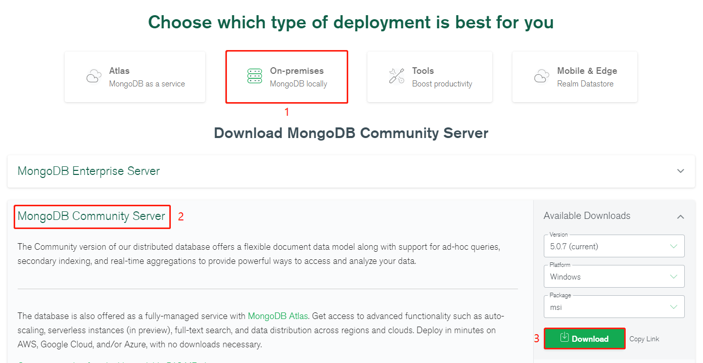

# 一、概述

MongoDB 是一个基于分布式文件存储的数据库。由 C++ 语言编写。旨在为 WEB 应用提供可扩展的高性能数据存储解决方案。

MongoDB 是一个介于关系数据库和非关系数据库之间的产品，是非关系数据库当中功能最丰富，最像关系数据库的。

# 二、下载

## 1. macOS

### 1.1. 下载

**# [官网下载](https://www.mongodb.com/download-center/community)**



**# Brew 下载**

[参考地址 >>](https://docs.mongodb.com/manual/tutorial/install-mongodb-on-os-x/)

```shell
$ brew tap mongodb/brew
$ brew install mongodb-community@4.2
$ mongo --version
MongoDB shell version v4.2.2
git version: a0bbbff6ada159e19298d37946ac8dc4b497eadf
allocator: system
modules: none
build environment:
    distarch: x86_64
    target_arch: x86_64
```

### 1.2. 运行

```shell
$ sudo mkdir -p /data/db
$ sudo chown -R 当前登录的用户名  /data
$ mongod --dbpath=/data/db
```

运行

```shell
$ mongo
```

浏览器输入：

```
http://localhost:27017/
```

网页呈现如下信息即表示成功：

```markdown
It looks like you are trying to access MongoDB over HTTP on the native driver port.
```

## 2. Windows

# 三、概念

| SQL术语/概念 | MongoDB术语/概念 | 解释/说明                           |
| :----------- | :--------------- | :---------------------------------- |
| database     | database         | 数据库                              |
| table        | collection       | 数据库表/集合                       |
| row          | document         | 数据记录行/文档                     |
| column       | field            | 数据字段/域                         |
| index        | index            | 索引                                |
| table joins  |                  | 表连接,MongoDB不支持                |
| primary key  | primary key      | 主键,MongoDB自动将_id字段设置为主键 |

通过下图实例，我们也可以更直观的了解Mongo中的一些概念：


