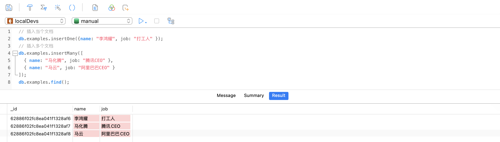
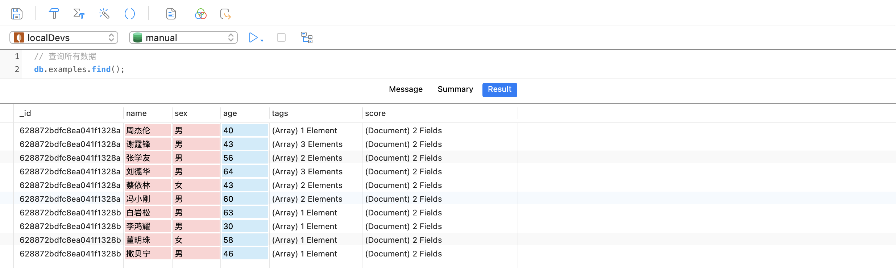
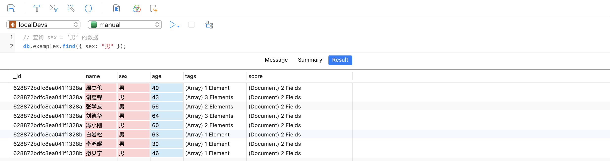
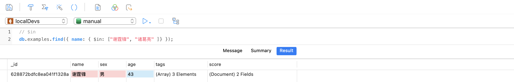
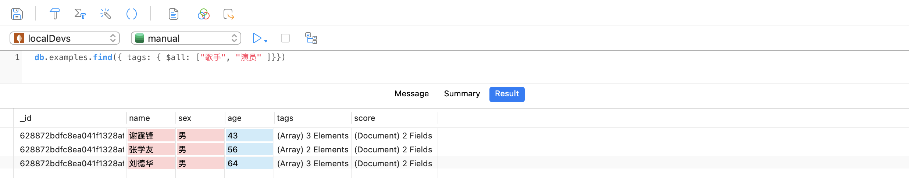
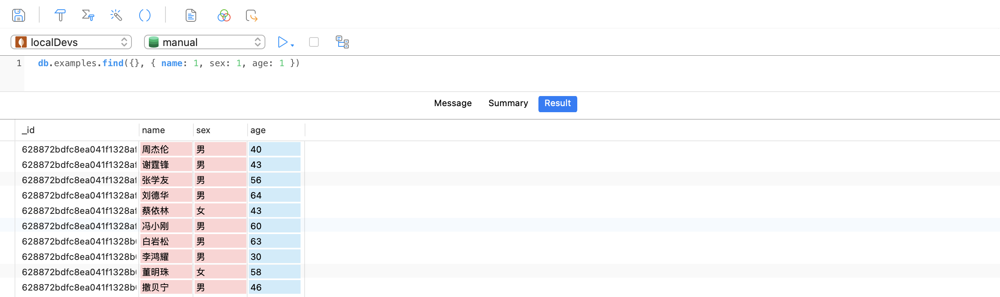
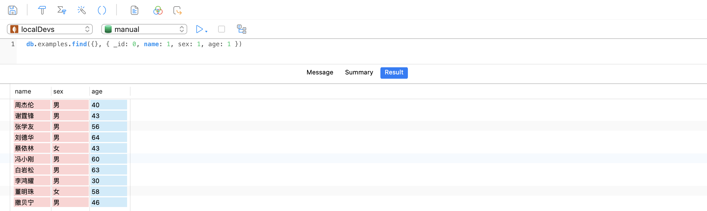
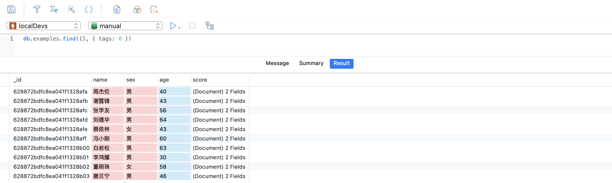

# 一、概述

[mongodb-org >>](https://www.mongodb.com/docs/manual/)

[mongoosejs-docs >>](https://mongoosejs.com/docs/guide.html)

MongoDB是一个由C++ 语言编写的 **基于分布式文件存储的数据库**。

MongoDB中的一条记录是一个文档，它是一个由字段和值对组成的数据结构。MongoDB文档类似于JSON对象。字段的值可以包括其他文档、数组和文档数组。


**@优势**:

- 在许多编程语言中，文档对应于本地数据类型。
- 嵌入的文档和数组减少了对昂贵连接的需要。
- 动态模式支持连贯多态性。

**@vs mySql**

- Mysql 数据库是类似于Excel **表格式** 的数据，这种表格式的数据库也称之为 **关系型数据库**，表叫做**关系表**。

- MongoDB 数据库存储的是类似 **JSON** 格式的数据，称之为 **bson**，这种数据库由于比较自由，数据间并不一定有关系，我们称之为**非关系型数据库**。然后又由于不是表结构，我们不再使用sql语句去操作他，所以我们也称MongoDB为 **nosql** 数据库的一种。

**@特点**

高性能、易部署、易使用，存储数据非常方便。

**@概念**

| SQL术语/概念  | MongoDB术语/概念 | 解释/说明                              |
| :------------ | :--------------- | :------------------------------------- |
| `database`    | `database`       | 数据库                                 |
| `table`       | `collection`     | 数据库表/集合                          |
| `row`         | `document`       | 数据记录行/文档                        |
| `column`      | `field`          | 数据字段/域                            |
| `index`       | `index`          | 索引                                   |
| `table joins` |                  | 表连接，MongoDB不支持                  |
| `Primary key` | `Primary key`    | 主键，MongoDB自动将`_id`字段设置为主键 |

> [参照 SQL 到 MongoDB 的映射图标 >>](https://docs.mongoing.com/mongodb-crud-operations/sql-to-mongodb-mapping-chart)

# 二、安装、启动

## 1. 下载

[点击前往官网下载中心 >>](https://www.mongodb.com/try/download/community)


根据系统，选择相应的安装包。

## 2. 安装

### macOS

**① 将压缩包解压至任意位置，我放在 *`/usr/local/`* 目录下，并重新命名为 *`mongodb`***

**② 添加环境变量**

```shell
$ open ~/.bash_profile
```

```shell
export MONGODB=/usr/local/mongodb/bin 
export PATH=$PATH:$MONGODB
```

**③ 查看版本，如果正常显示版本号则安装成功**

```shell
$ mongo --version
MongoDB shell version v5.0.3
```

**④ 创建目录**

```shell
$ cd /usr/local/mongodb/
$ mkdir -p data/logs data/db
$ cd /data/logs && touch mongodb.log
```

### windows

**① 下载 msi 文件之后，双击安装**

**② 修改安装目录**

默认会安装到C盘，你可以修改安装目录：


**③. 取消勾选 Install MongoDB Compass**

在安装过程中会出现如下界面，其中 **install mongoDB compass** 不要勾选需要去掉，否则可能要很长时间都一直在执行安装。

MongoDB Compass 是一个图形界面管理工具，我们可以在后面自己到官网下载安装，[前往下载 >>](https://www.mongodb.com/download-center/compass)。


**④ 安装完成**

- 安装目录下创建db目录：*`E:\MongoDB\data\db`*
- 然后将 bin 目录配置进入**环境变量**，配置步骤：右建此电脑 → 属性 → 高级系统设置 → 环境变量

## 3. 配置文件

[参考文档 >>](https://www.mongodb.com/docs/manual/reference/configuration-options/)

文件位置：

- macOS：*` /usr/local/etc/mongod.conf`*

- windows：*`<install directory>\bin\mongod.cfg`*

> **！Tips：**上面一般是默认的配置文件位置，如果没有找到对应的配置文件，可自行在安装位置 `bin` 目录下新建配置文件即可。

配置文件，以 `macOs` 为例：

```ini
# mongod.conf

# for documentation of all options, 
# see: http://docs.mongodb.org/manual/reference/configuration-options/

# 数据库设置 
storage:
  dbPath: /usr/local/mongodb/data/db
  journal:
    enabled: true

# 日志管理
systemLog:
  destination: file
  logAppend: true
  path:  /usr/local/mongodb/data/logs/mongodb.log
  quiet: true
 
# 进程守护（！Tips：windows 不支持） 
processManagement:
   fork: true
   
# 网络设置
net:
  port: 27017
  bindIp: 0.0.0.0

# 安全认证
security:
  authorization: enabled
```

> **！Tips**：
>
> - `windows` 不支持进程守护
> - 你应该将 `storage.dbpath` 和 `systemLog.path` 设置为你本地地址。

## 4. 启动

### macOS

```shell
$ mongod -f /etc/mongodb.conf
```

> **！Tips**：注意配置文件的位置。

重启服务

- 打开mac 启动台 → 其他 → 活动监视器 → 删除 mongodb 服务

- 在 *`data/db/`* 目录下删除 `mongod.lock` 文件

- 终端执行：`mongod --repair`

- 根据配置文件启动：`mongod -f /etc/mongodb.conf`

### windows

打开终端，以 **管理员身份运行**：

```shell
$ mongod -f "E:\MongoDB\bin\mongod.cfg" --serviceName "MongoDB" --install
```

```shell
# 查看服务
services.msc
# 启用服务
net start MongoDB
# 停止服务
net stop MongoDB
```

> **Tips：** 使用管理员模式运行终端，切记切记！

## 5. 验证

如果出现 successful 就表示服务已经启动成功

浏览器输入：

```
http://localhost:27017/
```

网页呈现如下信息即表示成功：

```markdown
It looks like you are trying to access MongoDB over HTTP on the native driver port.
```

# 三、Databases and Collections

[参考指南 >>](https://www.mongodb.com/docs/manual/core/databases-and-collections/)

## 1. Databases

```mysql
# 1. 查看数据库
show dbs 
# 2. 创建/切换数据库
use dbname
# 3. 查看当前数据库
db
# 4. 删除数据库
db.dropDatabase()
# 5. 查看服务器地址
db.getMongo()
# 6. 重命名数据库
```

> 提示：刚创建的数据库需要插入数据才能够显示。

## 2. Collections

1）常用指令：

```mysql
# 1. 创建集合
db.createCollection(name, options)
# 2. 创建集合并插入一个文档
db.COLLECTION_NAME.insert(document)
# 3. 查看集合
show collections / show tables
# 4. 删除集合
db.COLLECTION_NAME.drop()
# 5. 修改表名
db.COLLECTION_NAME.renameCollection("NEW_NAME");
# 6. 清空表数据
db.COLLECTION_NAME.remove({})
```

2）示例：

```shell
# 创建表
db.createCollection('usrs', {capped: true, size:6142800, max: 10000})
```

3）附录说明：

创建集合options说明：

| 字段          | 类型      | 描述                                                         |
| ------------- | --------- | ------------------------------------------------------------ |
| `capped`      | `Boolean` | （可选）如果为true，则创建固定集合。固定集合是指有着固定大小的集合，当达到最大值时，它会自动覆盖最早的文档。<br />**注意：当改值为  true 时，必须指定size 参数。** |
| `autoIndexId` | `Boolean` | （可选）如果为true，自动在 **_id** 字段创建索引，默认为 `false`。 |
| `size`        | `Number`  | （可选）为固定集合指定一个最大值，以千字节（KB）<br />**如果capped 为true，也需要指定该字段。** |
| `max`         | `Number`  | （可选）指定固定集合中包含文档的最大数量。                   |

> 提示：
>
> - 在插入文档时，MongoDB 首先检查固定集合的 size 字段，然后检查 max 字段，然后autoIndexId属性已经被遗弃了，未来将会被删除。
> - 在 MongoDB 中，其实当你插入一些文档时，MongoDB 也会自动创建集合。

# 四、CURD

```mysql
# 创建数据库 → dbName：manual
use manual
```

## 1. 插入文档

语法：

```mysql
# 插入单个文档
db.<collection-name>.insertOne(document)
# 插入多个文档
db.<collection-name>.insertMany([document...])
```

示例代码：

```mysql
# 插入当个文档
db.examples.insertOne({name: "李鸿耀", job: "打工人" });
# 插入多个文档
db.examples.insertMany([
	{ name: "马化腾", job: "腾讯CEO" },
	{ name: "马云", job: "阿里巴巴CEO" }
])
# 查询数据
db.example.find({})
```



> **！Tips：**
>
> - 插入文档时如果没有指定 `id`，MongoDB 会自动生成 `_id`，类型为 `ObjectId`
> - 当你直接执行插入文档的操作，如果数据库没有对应的表，会为你自动创建。

## 2. 查询文档

### 基础查询

示例数据：

```mysql
db.examples.insertMany([
	{name: "周杰伦", sex: "男", age: 40, tags: ["歌手"], score: { chinese: 58, english:　80 } },
	{name: "谢霆锋", sex: "男", age: 43, tags: ["歌手", "演员", "厨师"], score: { chinese: 76, english:　90 } },
	{name: "张学友", sex: "男", age: 56, tags: ["歌手", "演员"], score: { chinese: 80, english:　92 } },
	{name: "刘德华", sex: "男", age: 64, tags: ["歌手", "演员", "慈善家"], score: { chinese: 76, english:　90 } },
	{name: "蔡依林", sex: "女", age: 43, tags: ["歌手", "舞者"], score: { chinese: 68, english:　83 } },
	{name: "冯小刚", sex: "男", age: 60, tags: ["导演", "演员"], score: { chinese: 79, english:　68 } },
	{name: "白岩松", sex: "男", age: 63, tags: ["主持人"], score: { chinese: 98, english:　87 } },
	{name: "李鸿耀", sex: "男", age: 30, tags: ["打工人"], score: { chinese: 82, english:　60 } },
	{name: "董明珠", sex: "女", age: 58, tags: ["企业家"], score: { chinese: 84, english:　88 } },
	{name: "撒贝宁", sex: "男", age: 46, tags: ["主持人"], score: { chinese: 100, english:　93 } },
]);
```

代码示例：

- 查询所有数据

  

- 查询 sex = ’男‘ 的数据

  

- $in → 查询姓名为’谢霆锋‘ 或者 ”诸葛亮“ 的记录

  

- $and → 查询年龄大于等于60的男性

  

- $or → 查询性别为女 或者 年龄大于60的数据

  

- \$or + $And → 查询性别为男，并且年龄小于等于30或者语文成绩大于90的数据

  

### 数组查询

- 查询 tags 等于 ["歌手", "演员"] 的数据（元素和顺序一致）

  

  

- $all → 查询只要 tags 包含 歌手 和 演员 的数据

  

- 查询 tags 包含 演员的数据，只要有演员就返回：

  

### 数据映射

通过设置 `find` 的第二个参数可以控制是否返回某些列，`0`：隐藏 / `1`：显示

- 指定返回字段，比如只返回 name/sex/age

  

- 隐藏 `_id` 字段

  

- 去除指定字段，比如示例中我们去除 `tags` 字段，未设置的将会显示

  

- 映射返回数组中指定的数组元素，$slice 表示截取最后1个元素，不能使用下标

  如下示例查询谢霆锋的记录，并且隐藏 `_id` `score` `age`，其中 `tags` 只返回列表中的最后一个数据。

  

  

> `！Tips`
>
> - 除 `_id` 字段外，不能在映射文档中同时使用包含和去除语句。

## 3. 更新文档

插入文档Apis：

- [`db.collection.updateOne(filter, update, options)`](https://www.mongodb.com/docs/manual/reference/method/db.collection.updateOne/#mongodb-method-db.collection.updateOne)
- [`db.collection.updateMany(filter, update, options)`](https://www.mongodb.com/docs/manual/reference/method/db.collection.updateMany/#mongodb-method-db.collection.updateMany)
- [`db.collection.replaceOne(filter, update, options)`](https://www.mongodb.com/docs/manual/reference/method/db.collection.replaceOne/#mongodb-method-db.collection.replaceOne)

语法解读：

- `query` ：查询条件
- `update`：更新后的对象或指定一些更新的操作符
- `options`：可选项
  - `upsert`：可选，未查询到时是否插入updateObj，默认false。
  - `multi`：可选，是否更新所有查询到的文档，默认 false。

一般来讲，更新数据可使用 操作符，具体如下：

### $set

更新字段

```mysql
db.examples.update(
	{name: "周杰伦"},     
	{ 
		$set: { age: 30 }, 
		$currentDate: { lastModified: true } 
	}
)
```

### $inc

在原基础上累加：

```mysql
db.examples.update(
	{name: "周杰伦"},
	{ 
		$inc: { age: 10 },
		$currentDate: { lastModified: true }
	}
)
```

代码描述：查询 name 为周杰伦的记录，并将其 age 字段累加10

### $push

向数组中添加元素，不会覆盖已有的

```js
{ $push: { <field1>: <value1>, ... } }
```

```mysql
db.examples.update(
	{name: "周杰伦"},     
	{ 
		$push: { interest: "唱歌" }
	}
)
```

### $addToSet

给数组添加或者设置一个值

```js
{ $addToSet: { <field1>: <value1>, ... } }
```

## 4. 删除文档

```markdown
# 1. 删除单个文档
db.COLLECTION_NAME.deleteOne(query)
# 2. 删除多个文档
db.COLLECTION_NAME.deleteMany(query)
```

# 五、聚合管道 - 核心

[聚合管道操作符 >>](https://www.mongodb.com/docs/manual/reference/operator/aggregation/)

查询文档可以使用 `.find()` 方法，这里主要推荐高级用法：聚合管道查询 → [aggregation >>](https://www.mongodb.com/docs/manual/aggregation/)

聚合管道由一个或多个处理文档的阶段组成：

- 每个阶段对输入文档执行一个操作。例如，一个stage可以过滤文档、分组文档和计算值。
- 从一个阶段输出的文档被传递到下一个阶段。
- 聚合管道可以返回文档组的结果。例如，返回总和、平均值、最大值和最小值。

通过这张图，可以了解Aggregate处理的过程


## 1. Apis

聚合管道主要包含如下API：

| 命令                                                         | 功能描述                                                     |
| ------------------------------------------------------------ | ------------------------------------------------------------ |
| [`$match`](https://www.mongodb.com/docs/manual/reference/operator/aggregation/match/#mongodb-pipeline-pipe.-match) | 用于过滤数据，只输出符合条件的文档，与 `find()` 类似，基于MongoDB的标准查询操作 |
| [`$group`](https://www.mongodb.com/docs/manual/reference/operator/aggregation/group/#mongodb-pipeline-pipe.-group) | 将集合中的文档分组，可用于统计结果                           |
| [`$project`](https://www.mongodb.com/docs/manual/reference/operator/aggregation/project/#mongodb-pipeline-pipe.-project) | 修改输入文档的结构。可以用来重命名、增加或删除域，也可以用于创建计算结果以及嵌套文档 |
| [`$skip`](https://www.mongodb.com/docs/manual/reference/operator/aggregation/skip/#mongodb-pipeline-pipe.-skip) | 在聚合管道中跳过指定数量的文档                               |
| [`$limit`](https://www.mongodb.com/docs/manual/reference/operator/aggregation/limit/#mongodb-pipeline-pipe.-limit) | 用来限制MongoDB聚合管道返回的文档数                          |
| [`$unwind`](https://www.mongodb.com/docs/manual/reference/operator/aggregation/unwind/#mongodb-pipeline-pipe.-unwind) | 将文档中的某一个数组类型字段拆分成多条，每条包含数组中的一个值 |
| [`$lookup`](https://www.mongodb.com/docs/manual/reference/operator/aggregation/lookup/#mongodb-pipeline-pipe.-lookup) | 引入其他集合的数据（表关联查询）                             |
| [`$sort`](https://www.mongodb.com/docs/manual/reference/operator/aggregation/sort/#mongodb-pipeline-pipe.-sort) | 将输入文档排序后输出 *`1`：升序，`-1`：降序，默认为升序显示* |
| [`$rank`](https://www.mongodb.com/docs/v5.0/reference/operator/aggregation/rank/#mongodb-group-grp.-rank) / [`$denseRank`](https://www.mongodb.com/docs/v5.0/reference/operator/aggregation/denseRank/#mongodb-group-grp.-denseRank) | 排名查询                                                     |

> **Tips：**同样的操作符以及条件, 不同的排列顺序对查询结果会有影响

## 2. 单一用途聚合方法

单一用途聚合方法从单个集合聚合文档。这些方法很简单，但缺乏聚合管道的功能。

- [`db.collection.count()`](https://www.mongodb.com/docs/manual/reference/method/db.collection.count/#mongodb-method-db.collection.count)：返回集合或视图中文档数量的计数

## 3. 扩展示例

### 示例1：兰州拉面订单统计

插入示例数据：

```mysql
db.examples.insertMany([
	{ name: "孜然牛肉拌面", size: "中份", nums: 3, price: 16, date: "2022/01/01" },
	{ name: "红烧牛肉拌面", size: "中份", nums: 2, price: 16, date: "2022/01/01" },
	{ name: "葱爆牛肉拌面", size: "小份", nums: 6, price: 14, date: "2022/01/01" },
	{ name: "葱爆牛肉拌面", size: "大份", nums: 3, price: 18, date: "2022/01/02" },
	{ name: "辣子鸡块拌面", size: "中份", nums: 9, price: 16, date: "2022/01/02" },
	{ name: "青椒炒蛋拌面", size: "中份", nums: 2, price: 13, date: "2022/01/02" },
	{ name: "洋葱炒肉拌面", size: "中份", nums: 4, price: 14, date: "2022/01/02" },
	{ name: "孜然牛肉拌面", size: "小份", nums: 3, price: 14, date: "2022/01/03" },
	{ name: "肉末茄子拌面", size: "中份", nums: 5, price: 14, date: "2022/01/03" },
	{ name: "红烧牛肉拌面", size: "中份", nums: 2, price: 16, date: "2022/01/04" },
	{ name: "肉末茄子拌面", size: "中份", nums: 8, price: 16, date: "2022/01/04" },
	{ name: "孜然牛肉拌面", size: "中份", nums: 1, price: 16, date: "2022/01/04" },
])
```

#### 统计中份拌面各类型的销售份数

执行代码：

```mysql
db.examples.aggregate([
    // Stage 1：过滤中份拌面
    { $match: { size: "中份" } },
    // Stage 2：按照拌面类型(name)分组，并计算销量(nums)
    { $group: { _id: "$name", totalNums: {$sum: "$nums" }  }},
		// State 3：格式化输出，将 _id 重命名为 name 输出
		{ $project: { _id: 0, name: "$_id", totalNums: 1  }}		
])
```

- `$match` statge：
  - 将订单记录过滤为 **中份** 的数据
  - 将剩余的文档传递到$group阶段。
- `$group` stage：
  - 将其余文档按拌面名称 `name` 分组。
  - 使用 `$sum` 计算每个拌面名称的总订单量。总数存储在聚合管道返回的 `totalOrderNums` 字段中。
- `$project` stage：
  - 指定输出文档，隐藏 `_id`，并将 `name` 指向 `_id` 显示。

输出结果：

```js
// 1
{ "name": "孜然牛肉拌面", "totalNums": 7 }

// 2
{ "name": "洋葱炒肉拌面", "totalNums": 4 }

// 3
{ "name": "红烧牛肉拌面", "totalNums": 4 }

// 4
{ "name": "辣子鸡块拌面", "totalNums": 11}

// 5
{ "name": "肉末茄子拌面", "totalNums": 13}
```

#### 计算总订单值和平均订单数量

测试数据

```mysql
db.examples.aggregate([
    // Stage 1：过滤中份拌面
    { $match: { size: "中份" } },
    // Stage 2：根据日期进行分组，然后统计当天的销售总额和平均卖出的份数
    { $group: { 
				_id: "$date", 
				totalOrderPrice: {$sum: { $multiply: [ "$price", "$nums" ] } },
				averageOrderNums: { $avg: "$nums" }
		}},
		// Stage 3：结果降序输出		
		{ $sort: { totalOrderPrice: -1 }}	
])
```

### 示例2：排名

示例数据：

```mysql
db.examples.insertMany([
  {name: "刘德华", sex: "男", age: 64, score: 93 },
	{name: "周杰伦", sex: "男", age: 39, score: 90 },
	{name: "林俊杰", sex: "男", age: 36, score: 88 },
	{name: "罗志祥", sex: "男", age: 34, score: 60 },
	{name: "蔡依林", sex: "女", age: 35, score: 76 },
	{name: "王力宏", sex: "男", age: 38, score: 84 },
	{name: "张学友", sex: "男", age: 65, score: 90 },
	{name: "邓紫棋", sex: "女", age: 35, score: 88 },
])
```

#### 查询指定用户的排名

思路：排序 → 查找

聚合：`$indexOfArray` / `$group` / `$project `

需求：查询王力宏的排名

```mysql
db.examples.aggregate([
	{ $sort: { score: -1 }}, 
	{ $group: { _id: null, all: { $push: "$name" }} }, 
	{ $project: { _id: 0, total: { $size: "$all" }, rank: { $indexOfArray: ["$all",  "王力宏"] }}}
])
```

根据 ObjectId 来查询排名：

```mysql
db.users.aggregate([
	{ $sort: { score: -1 }}, 
	{ $group: { _id: null, all: { $push: "$_id" }} }, 
	{ $project: { _id: 0, total: { $size: "$all" }, rank: { $indexOfArray: ["$all",  Object(id值)] }}}
])
```

#### $rank

```mysql
db.examples.aggregate([
	{
		$setWindowFields: {
			// 根据sex分组排名，即男生和男生排名，女生和女生排名
			partitionBy: "$sex",
			// 根据score排序，排名依据
			sortBy: { score: -1 },
			// 输出排名
			output: {
				// 排名显示字段名
				rankScoreForSex: {
						// 并列名字排名
						$denseRank: {}
				}
			}
		}
	},
])
```

# 六、 索引

### 6.1. 概述

索引通常能够极大的提高查询的效率，如果没有索引，MongoDB 在读取数据时必须扫描集合中的每个文件并选取那些符合查询条件的记录。

这种扫描全集合的查询效率是非常低的，特别在处理大量的数据时，查询可以要花费几十秒甚至几分钟，这对网站的性能是非常致命的。

索引是特殊的数据结构，索引存储在一个易于遍历读取的数据集合中，索引是对数据库表中一列或多列的值进行排序的一种结构

### 6.2. API

```markdown
# 1. 创建索引/v3.0之前
db.collection_name.ensureIndex(keys, options)
# 2. 创建索引/v3.0之后
db.collection_name.createIndex(keys, options)
# 3. 查看集合索引
db.collection_name.getIndexes()
# 4. 查看集合索引大小
db.collection_name.totalIndexSize()
# 5. 删除集合所有索引
db.collection_name.dropIndexes()
# 6. 删除集合指定索引
db.collection_name.dropIndex("索引名称")
```

> 语法提示：语法中 Key 值为你要创建的索引字段，1 为指定按升序创建索引，如果你想按降序来创建索引指定为 -1 即可。

options 参数类型：

| Parameter          | Type          | Description                                                  |
| :----------------- | :------------ | :----------------------------------------------------------- |
| background         | Boolean       | 建索引过程会阻塞其它数据库操作，background可指定以后台方式创建索引，即增加 "background" 可选参数。 "background" 默认值为**false**。 |
| unique             | Boolean       | 建立的索引是否唯一。指定为true创建唯一索引。默认值为**false**. |
| name               | string        | 索引的名称。如果未指定，MongoDB的通过连接索引的字段名和排序顺序生成一个索引名称。 |
| dropDups           | Boolean       | **3.0+版本已废弃。**在建立唯一索引时是否删除重复记录,指定 true 创建唯一索引。默认值为 **false**. |
| sparse             | Boolean       | 对文档中不存在的字段数据不启用索引；这个参数需要特别注意，如果设置为true的话，在索引字段中不会查询出不包含对应字段的文档.。默认值为 **false**. |
| expireAfterSeconds | integer       | 指定一个以秒为单位的数值，完成 TTL设定，设定集合的生存时间。 |
| v                  | index version | 索引的版本号。默认的索引版本取决于mongod创建索引时运行的版本。 |
| weights            | document      | 索引权重值，数值在 1 到 99,999 之间，表示该索引相对于其他索引字段的得分权重。 |
| default_language   | string        | 对于文本索引，该参数决定了停用词及词干和词器的规则的列表。 默认为英语 |
| language_override  | string        | 对于文本索引，该参数指定了包含在文档中的字段名，语言覆盖默认的language，默认值为 language |

**# 注意：**

利用 TTL 集合对存储的数据进行失效时间设置：经过指定的时间段后或在指定的时间点过期，MongoDB 独立线程去清除数据。类似于设置定时自动删除任务，可以清除历史记录或日志等前提条件，设置 Index 的关键字段为日期类型 new Date()。

### 6.3. 索引类型

**1）_id 索引**

创建集合时，默认情况下MongoDB都会帮助我们创建一个名为`_id`的字段，这个字段就是一个索引。特别注意的是，固定集合不会将 _id 默认作为索引。

**2）复合索引**

如果我们的查询条件有多个的话，我们可以对这多个查询条件都建立索引，比如我们可以对heros文档中的position和proficient字段都建立索引，如下：

```mysql
> db.heros.createIndex({position:1, proficient:1})
```

此时执行如下查询语句时就会用到这个复合索引：

```mysql
> db.heros.find({position:"法师", proficient:{$gt:1000}})
```

上述示例查询英雄定位为法师并且熟练度在1000以上的数据。

**3）过期索引**

过期索引就是一种会过期的索引，在索引过期之后，索引对应的数据会被删除，创建方式如下：

```mysql
> db.collection_name.createIndex({time:1},{expireAfterSeconds:30})
```

expireAfterSeconds表示索引的过期时间，单位为秒。time表示索引的字段，time的数据类型必须是ISODate或者ISODate数组，否则的话，当索引过期之后，time的数据就不会被删除。

**4）全文索引**

[参考地址 >>](https://docs.mongodb.com/manual/reference/text-search-languages/)

MongoDB 从3.2 版本以后添加了对中文索引的支持。下面给大家举一个例子，我的数据是这样的：

```
{"name":"阿珂", "position": "刺客", "location": "野区", "speciality":"突进/收割"}
{"name":"关羽", "position": "战士", "location": "上路", "speciality":"突进/先手"}
{"name":"婉儿", "position": "法刺", "location": "中路", "speciality":"突进/收割"}
{"name":"蒙犽", "position": "射手", "location": "下路", "speciality":"远程/消耗"}
{"name":"李白", "position": "刺客", "location": "野区", "speciality":"突进/收割"}
```

我们可以给 speciality 字段添加一个全文索引，值为 `text`

```mysql
> db.heros.createIndex({speciality: "text"});
```

MongoDB会自动对speciality字段的数据进行分词，然后我们就可以通过如下语句进行查询：

```mysql
> db.heros.find({$text:{$search:"突进"}})
```

# 七、用户管理

1）基础命令

```markdown
# 1. 创建用户
db.createUser({user:'账号', pwd:'密码', roles:[{role:'角色名', db: '数据库名'}]})
# 2. 查看用户
db.getUsers()
# 3. 移除用户
db.dropUser("用户名")
# 4. 用户登陆
db.auth(user, pwd) 
# 5. 修改用户密码
db.changeUserPassword('用户名', '新密码')
```

代码示例：

```mysql
# 创建超级用户
> use admin
> db.createUser({user:'root', pwd:'123', roles:[{role:'root', db: 'admin'}]})
# 创建普通用户
> db.createUser({user:'lee', pwd:'123', roles:[{role:'readWrite', db: 'DB-TEST'}]})
```

> 提示：创建普通用户时需先登陆超级用户再创建。

2）角色分类

- 数据库用户角色：`read`、`readWrite`
- 数据库管理员角色：`dbAdmin`、`dbOwner`、`userAdmin`
- 集群管理员角色：`clusterAdmin`、`clusterManager`、`clusterMonitor`、`hostManager`
- 备份和恢复角色：`backup`、`restore`
- 所有数据库角色：`readAnyDatabase`、`readWriteAnyDatabase`、`userAdminAnyDatabase`、`dbAdminAnyDatabase`
- 超级用户角色：`root`

3）角色功能

- `read`：允许用户读取指定数据库
- `readWrite`：允许用户读写指定数据库
- `readAnyDatabase`：只在`admin`数据库中可用，赋予用户所有数据库的读权限
- `readWriteAnyDatabase`：只在`admin`数据库中可用，赋予用户所有数据库的读写权限
- `dbAdmin`：允许用户在指定数据库中执行管理函数，如索引创建、删除，查看统计或访问`system.profile`
- `dbAdminAnyDatabase`：只在`admin`数据库中可用，赋予用户所有数据库的`dbAdmin`权限。
- `userAdmin`：允许用户向`system.users`集合写入，可以找指定数据库里创建、删除和管理用户
- `userAdminAnyDatabase`：只在`admin`数据库中可用，赋予用户所有数据库的`userAdmin`权限
- `clusterAdmin`：只在`admin`数据库中可用，赋予用户所有分片和复制集相关函数的管理权限。
- `root`：只在`admin`数据库中可用。超级账号，超级权限

# 八、内置运算符

[参考指南 >>](https://docs.mongoing.com/can-kao/yun-suan-fu)

## 附录1：查询操作符

- `$in`：查询值为指定集合中某个元素时
- `$nin`：查询值不为指定集合中某个元素时
- `$gt[e]`：大于[等于]某个值
- `$lt[e]`：小于[等于]某个值
- `$ne`：不等于某个值
- `$or`：或查询
- `$all`：匹配所有

## 附录2：[更新操作符 >>](https://www.mongodb.com/docs/manual/reference/operator/update/)

### Fields

- `$currentDate`：将字段的值设置为当前日期，可以是日期或时间戳。*
- `$inc`：将字段的值增加/累加指定数量。*
- `$min`：仅当指定值小于现有字段值时才更新字段。
- `$max`：仅当指定值大于现有字段值时才更新字段。
- `$mul`：将字段的值乘以指定的量。
- `$rename`：重命名一个字段。
- `$set`：设置文档中某个字段的值。*
- `$setOnInsert`：从文档中插入指定的字段。
- `$unset`：从文档中移除指定的字段。

### Array

- `$push`：向数组中添加一个项。
- `$pop`：移除数组的第一项或最后一项。
- `$pull`：删除与指定查询匹配的所有数组元素。
- `$pull`：从数组中移除所有匹配的值。
- `$addToSet`：仅当数组中不存在元素时，才向数组中添加元素。

# 九、可视化工具

1. [前往下载 Nacicat Premium >>](https://www.navicat.com.cn/products/navicat-premium)
2. [前往下载 MongoDB Compass >>](https://www.mongodb.com/try/download/compass)
3. [前往下载 Robo 3T >>](https://studio3t.com/download/)

参考指南：

- [Navicat Premium 16.0.10 破解安装指南 >>](https://cloud.tencent.com/developer/article/1953103)

# 十、扩展

## 1. 忘记密码

### macOS

```shell
sudo vim /etc/mongodb.conf     # 修改 mongodb 配置，将 auth = true 注释掉，或者改成 false
...							   # 参照上述示例，重启mongo服务
mongo                          # 运行客户端（也可以去mongodb安装目录下运行这个）
use admin                      # 切换到系统帐户表
db.getUsers()                  # 查看当前帐户（密码有加密过）
db.system.users.remove({})     # 删除所有帐户
db.addUser('admin','password') # 添加新帐户

sudo vim /etc/mongodb.conf     # 恢复 auth = true
service mongodb restart        # 重启 mongodb 服务
...							   # 参照上述示例，重启mongo服务
```


